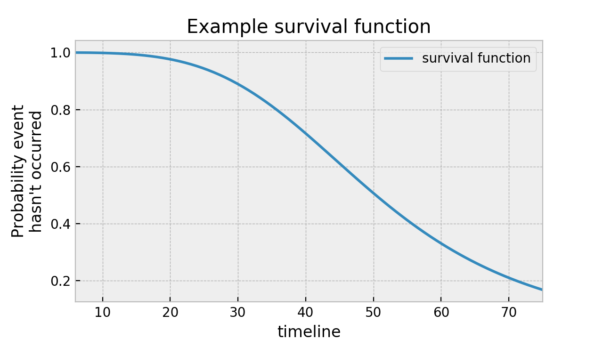
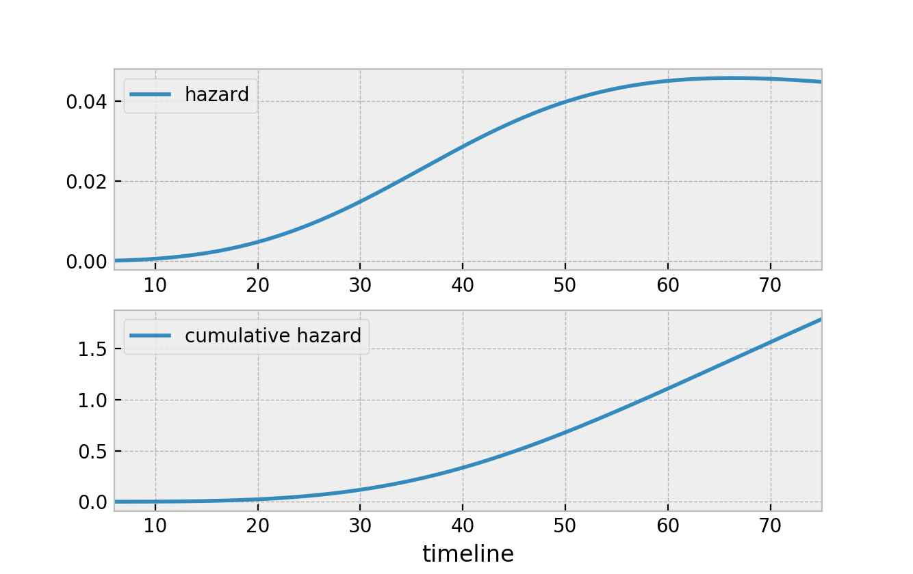

## Censoring
- `Censoring` means we don’t observe the proper end event. Why?
- (a) They're still ruling in 2008 → `right-censored`.
- (b) They died while in office → `right-censored` because they didn’t voluntarily retire.

```bash
Retirement = event
Died/still in office = censored
```
- This shows that `event` and `censoring` can mean different things, depending on what you're modeling.

## Survival Function – S(t)
- S(t) is the probability that the event has not occurred by time t
- y axis indicates probability that the event hasn't occured
- we can see that at time 40, about 75% of the population is still alive.


## Hazard Function – h(t)
- h(t) is the instantaneous rate at which the event occurs at exactly time t, given that the subject has survived up to that point.
-  Hazard function is like saying, "There’s a 10% chance of rain per hour at 4 PM", But that doesn't mean it will rain exactly at 4 PM, just that the risk of rain is higher then


## Time varying survival regression 
- It means the features (covariates) that affect survival are not constant — they can change during the observation period for the same individual.

| Machine\_ID | Start\_Time | Stop\_Time | Temperature | Load | Failed |
| ----------- | ----------- | ---------- | ----------- | ---- | ------ |
| M01         | 0           | 10         | 40°C        | Low  | 0      |
| M01         | 10          | 20         | 70°C        | High | 1      |

- The same machine (M01) is recorded twice.
- Its features (temperature, load) changed over time.
- It failed during the second interval.

## Regular (time-invariant) models
- the covariates are fixed — each subject has one row only

| Machine\_ID | Temperature | Load | Duration | Failed |
| ----------- | ----------- | ---- | -------- | ------ |
| M01         | 65°C        | High | 20       | 1      |

- These models assume the features stay the same throughout the entire observed period and in future too.

## Prediction difficulty
- In `time-varying survival regression`, to predict, we would need to know the covariates values beyond the observed times... (dynamic rows & rows of covariates, which is not possible to get), so this model is not for prediction usually
- In `Other Regular survival models`, to predict, the model doesn't need to know future covariate values, just take the current/latest readings of the machine

## Data Correctness for time based survival regression
| ID | start | stop | feature1 | feature2 | event |
| -- | ----- | ---- | -------- | -------- | ----- |
| A  | 0     | 5    | 10       | 0.5      | 0     |
| A  | 5     | 12   | 12       | 0.7      | 1     |
| A  | 12    | 22   | 11       | 0.8      | 1     |

- This table is invalid for time based survival modeling
- The event column (1) means the event happened in that time interval.
- A subject can only experience the event once.
- After the event, they are no longer at risk and should be removed from the dataset.
- The correct format should have only one row with event=1, and it should be the final row for that subject.

| ID | start | stop | feature1 | feature2 | event |
| -- | ----- | ---- | -------- | -------- | ----- |
| A  | 0     | 5    | 10       | 0.5      | 0     |
| A  | 5     | 12   | 12       | 0.7      | 1     |

- valid scenario is 

| ID | start | stop | feature1 | feature2 | event |                         
| -- | ----- | ---- | -------- | -------- | ----- | 
| A  | 0     | 5    | 10       | 0.5      | 0     |                        
| A  | 5     | 12   | 12       | 0.7      | 0     |                         
| A  | 12    | 22   | 11       | 0.8      | 0     | 

- If you put event=1 in more than one row, Lifelines and any other survival library will interpret this as multiple deaths, which is logically invalid for standard survival models.

## Conclusion
| Situation                           | valid      | Notes                                 |
| ----------------------------------- | ---------- | ------------------------------------- |
| One `event=1` row per individual    | Yes        | This is standard and required         |
| Multiple `event=1` rows per subject | No         | Invalid — subject can only "die" once |
| All `event=0` → no death (censored) | Yes        | Indicates they survived until the end |

- So In both regular and time-varying survival models in lifelines (and in standard survival analysis generally): <br>
`Each subject (or asset) is assumed to experience the event at most once.`

## Note
- `WeibullAFTFitter`

| ID       | duration | event | Interpretation                                                                                                                           |
| -------- | -------- | ----- | ---------------------------------------------------------------------------------------------------------------------------------------- |
| M001\_E1 | 100      | 1     | The machine failed after **100 days** in its **first episode**.                                                                          |
| M001\_E2 | 85       | 1     | The machine was repaired, and then failed again after **85 days**.                                                                       |
| M001\_E3 | 95       | 0     | The machine was repaired again, but it was **still working after 95 days** (no failure seen yet). So this episode is **right-censored**. |
