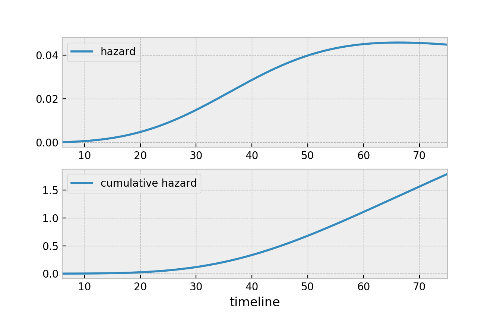

## Censoring
- `Censoring` means we don’t observe the proper end event. Why?
- (a) They're still ruling in 2008 → `right-censored`.
- (b) They died while in office → `right-censored` because they didn’t voluntarily retire.

```bash
Retirement = event
Died/still in office = censored
```
- This shows that `event` and `censoring` can mean different things, depending on what you're modeling.

## Survival Function – S(t)
- S(t) is the probability that the event has not occurred by time t
- y axis indicates probability that the event hasn't occured
- we can see that at time 40, about 75% of the population is still alive.


## Hazard Function – h(t)
- h(t) is the instantaneous rate at which the event occurs at exactly time t, given that the subject has survived up to that point.
-  Hazard function is like saying, "There’s a 10% chance of rain per hour at 4 PM", But that doesn't mean it will rain exactly at 4 PM, just that the risk of rain is higher then
